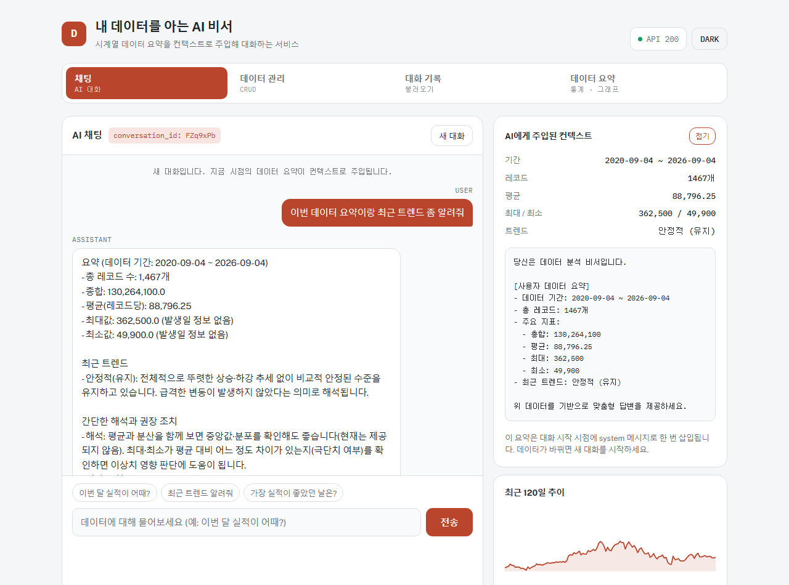
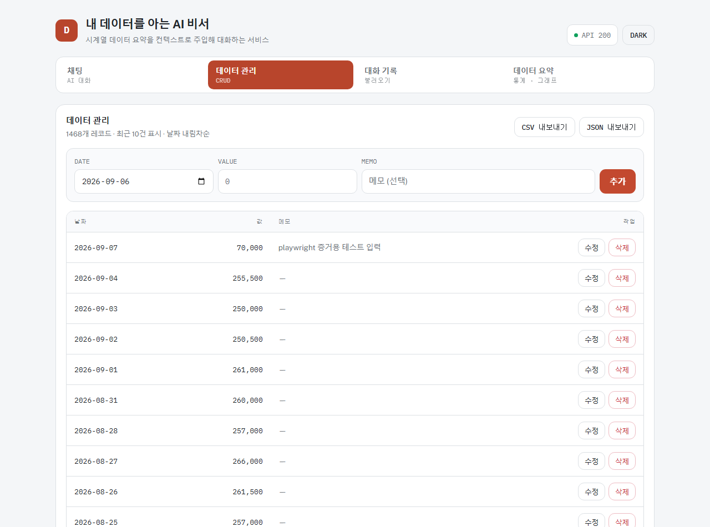
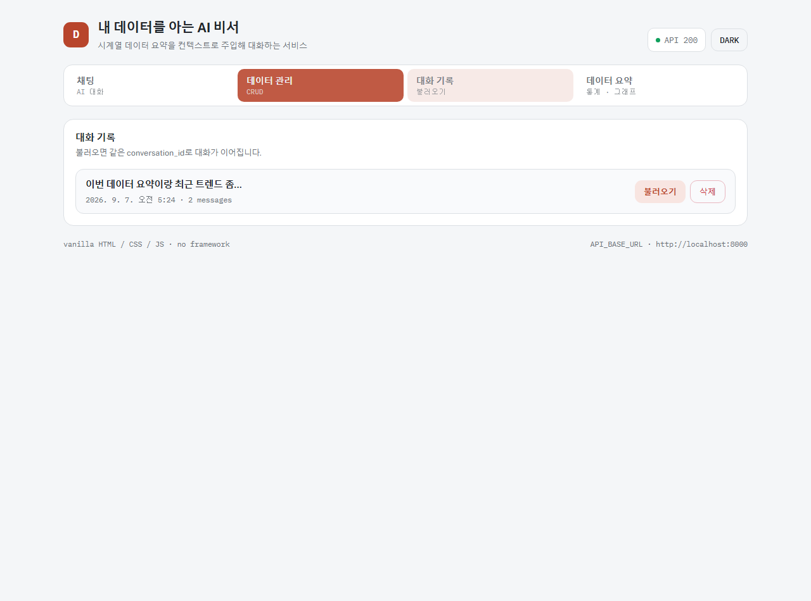
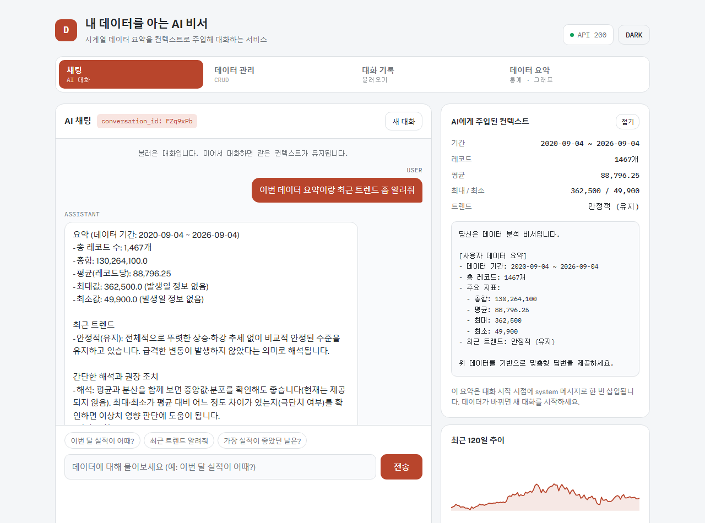
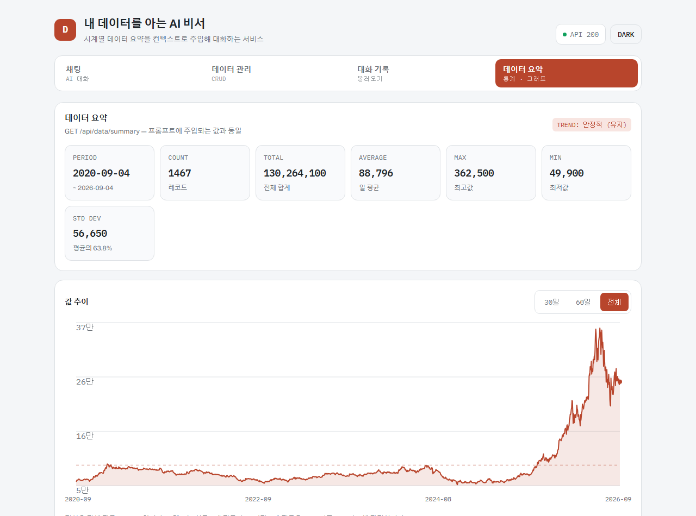
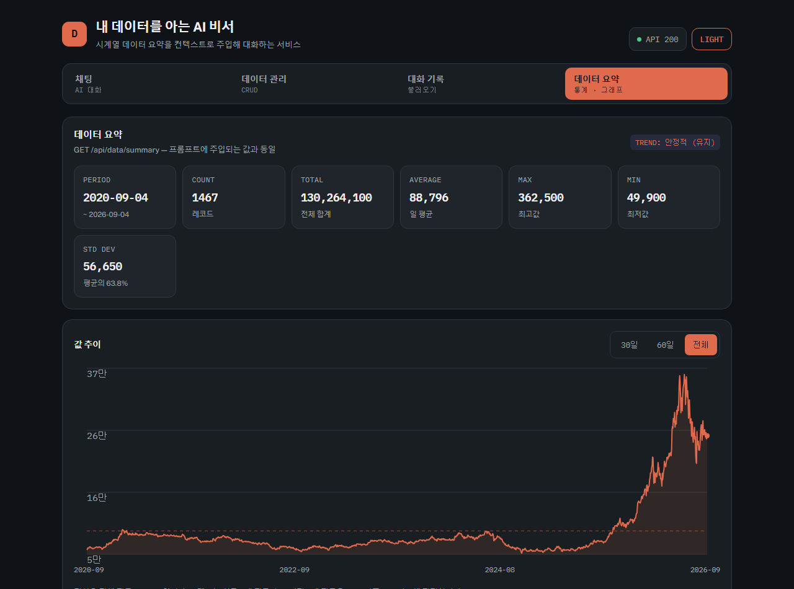

# 내 데이터를 아는 AI 비서

일반적인 ChatGPT는 여러분의 데이터를 모릅니다. "이번 달 실적이 어때?"라고 물어도 일반적인 답변만
돌아옵니다. 이 프로젝트는 사용자가 직접 쌓은 시계열 데이터를 분석하고, 그 요약을 AI에게 컨텍스트로
주입해서, **내 상황을 실제로 아는 AI 비서**와 대화할 수 있게 해주는 풀스택 웹 서비스입니다.

실제 배포된 데모는 삼성전자 2020~2026년 일별 종가 데이터(6년치, 1,467건,
`data/samsung_2020_2026.csv`)를 사용한다 — 가짜로 생성한 매출액보다 평가자에게 훨씬 설득력 있는
시연이 되도록, 합성 데이터 생성 스크립트(`generate_sample_data.py`) 대신 Yahoo Finance에서 직접 받은
실제 시계열 데이터를 그대로 적재했다. 2년치로는 장기 추세 분석에 부족하다고 판단해 처음엔 2023~2024
2년치로 시작했다가 6년치로 다시 교체했다 (아래 [트러블슈팅](#실제로-겪은-문제와-해결-트러블슈팅-기록)
11번 참고).

이 문서는 이 프로젝트를 전혀 모르는 사람이 코드 한 줄 안 보고도 처음부터 똑같이 재구현할 수 있을
만큼 상세하게 쓰였습니다. "무엇을 만들었는가"뿐 아니라 "왜 이렇게 만들었는가", "만들면서 실제로 어떤
문제에 부딪혔고 어떻게 고쳤는가"까지 전부 기록했습니다.

---

## 목차

1. [라이브 데모](#라이브-데모)
2. [기술 스택과 선택 이유](#기술-스택과-선택-이유)
3. [아키텍처](#아키텍처)
4. [핵심 기능 상세](#핵심-기능-상세)
5. [API 레퍼런스](#api-레퍼런스)
6. [데이터 모델 (Firestore 스키마)](#데이터-모델-firestore-스키마)
7. [AI 컨텍스트 주입 메커니즘](#ai-컨텍스트-주입-메커니즘)
8. [프론트엔드 구조](#프론트엔드-구조)
9. [처음부터 재구현하기](#처음부터-재구현하기)
10. [로컬 개발](#로컬-개발)
11. [배포](#배포)
12. [환경 변수 전체 레퍼런스](#환경-변수-전체-레퍼런스)
13. [실제로 겪은 문제와 해결 (트러블슈팅 기록)](#실제로-겪은-문제와-해결-트러블슈팅-기록)
14. [관련 연구](#관련-연구)
15. [프로젝트 구조](#프로젝트-구조)

---

## 라이브 데모

| 구분 | URL |
|---|---|
| 프론트엔드 (Vercel) | https://codyssey-8-pro-ject.vercel.app |
| 백엔드 API (Render) | https://codyssey-8-project.onrender.com |
| Swagger UI (API 문서) | https://codyssey-8-project.onrender.com/docs |
| GitHub Releases (배포 URL 고정 기록) | 저장소의 **Releases** 탭 참고 |

> ⚠️ 백엔드는 Render 무료 티어라 일정 시간 요청이 없으면 슬립 상태로 들어갑니다. 슬립 후 첫 요청은
> 콜드 스타트로 10~30초 정도 걸릴 수 있으니, 첫 응답이 늦더라도 잠시 기다려주세요.

### 스크린샷 (실제 배포 사이트를 Playwright로 직접 조작해서 캡처한 증거)

**1. 데이터 요약이 반영된 AI 채팅** — 사용자의 질문(USER)과, `GET /api/data/summary`로 계산된 실제
통계를 근거로 답하는 AI의 응답(ASSISTANT)이 함께 보인다. 오른쪽에는 "AI에게 주입된 컨텍스트" 패널이
있어 이번 대화에 실제로 삽입된 system prompt 원문을 그대로 펼쳐볼 수 있다.



**2. 데이터 관리 (CRUD)** — 상단 입력 폼으로 새 데이터를 추가하면(날짜/값/메모), 즉시 테이블 맨 위에
반영된다. 각 행에는 수정/삭제 버튼이 있고, CSV/JSON 내보내기 버튼도 있다.



**3. 대화 기록 목록** — 저장된 모든 대화가 제목(첫 메시지 20자)과 생성 시각으로 나열된다.



**4. 대화 불러오기** — "불러오기"를 누르면 채팅 탭으로 자동 전환되면서 해당 대화의 전체 메시지가
그대로 복원되고, 그 상태에서 이어서 대화할 수 있다(`conversation_id`가 유지됨). 첫 번째 어시스턴트
메시지 아래에는 "TOOL CALL TRACE"로 이 답변이 만들어진 3단계(요약 조회 → 프롬프트 주입 → LLM 호출)를
표시한다.



**5. 데이터 요약 카드 + 추이 그래프** — 기간/개수/총합/평균/최대/최소/표준편차 7개 카드와, 라이브러리
없이 순수 SVG로 그린 값 추이 라인차트(30일/60일/전체 구간 전환, 전체 평균 점선 포함)를 보여준다.



**6. 다크 모드 (보너스)** — 우측 상단 버튼으로 라이트/다크 테마를 전환할 수 있고, 선택값은
`localStorage`에 유지된다.



이 6장은 `backend/e2e_capture.py`라는 Playwright 스크립트로 실제 브라우저를 띄워 클릭·입력까지
수행한 뒤 캡처한 것이며, 수동으로 사람이 찍은 게 아니라 코드로 재현 가능하다.

---

## 기술 스택과 선택 이유

| 영역 | 기술 | 선택 이유 |
|---|---|---|
| 백엔드 프레임워크 | FastAPI + uvicorn | 과제 지정 요구사항. Pydantic 기반 자동 검증, Swagger UI 자동 생성 |
| 데이터베이스 | Firebase Firestore (Native mode) | 과제 지정 요구사항. NoSQL 문서 DB, 서버리스, `google-cloud-firestore` 클라이언트로 접근 |
| AI | OpenAI 호환 API (Codyssey 게이트웨이, 모델 `gpt-5-mini`) | 과제에서 제공하는 교육용 API 게이트웨이. OpenAI SDK를 `base_url`만 바꿔서 그대로 사용 가능 |
| 프론트엔드 | 바닐라 HTML/CSS/JavaScript | 과제 지정 요구사항 (프레임워크 사용 금지) |
| 백엔드 배포 | Render | 과제 지정 요구사항. Python 앱을 Git 연동만으로 배포 가능 |
| 프론트엔드 배포 | Vercel | 과제 지정 요구사항. 정적 사이트 + 빌드 스크립트로 환경변수 주입 가능 |
| E2E 검증 | Playwright (Python) | 브라우저 자동화 도구가 이 개발 환경에서 로컬호스트(사설 IP)에 접근하지 못하는 제약이 있어, 별도 프로세스로 Chromium을 직접 띄워 실제 클릭·입력·스크린샷을 수행 |

---

## 아키텍처

```mermaid
flowchart LR
    subgraph Browser["브라우저 (바닐라 JS)"]
        UI[index.html + tabs]
    end

    subgraph Vercel["Vercel (정적 호스팅)"]
        FE[frontend/*]
        BuildJS["build.js\n(API_BASE_URL 주입)"]
    end

    subgraph Render["Render (FastAPI)"]
        API[main.py]
        DataR[routers/data.py]
        ConvR[routers/conversations.py]
        ChatR[routers/chat.py]
        DataS[services/data_service.py]
        ConvS[services/conversation_service.py]
        ChatS[services/chat_service.py]
    end

    subgraph GCP["Google Cloud"]
        FS[(Firestore\ndata / conversations)]
    end

    subgraph Codyssey["Codyssey 게이트웨이"]
        LLM[gpt-5-mini\n/v1/chat/completions]
    end

    UI -->|fetch| FE
    BuildJS -.빌드 시 config.js 생성.-> FE
    FE -->|HTTPS + CORS| API
    API --> DataR --> DataS --> FS
    API --> ConvR --> ConvS --> FS
    API --> ChatR --> ChatS
    ChatS -->|요약 조회| DataS
    ChatS -->|대화 저장/조회| ConvS
    ChatS -->|system prompt 주입 후 호출| LLM
```

### 요청 흐름 예시: `POST /api/chat`

1. 프론트엔드가 `{ message, conversation_id }`를 백엔드로 전송
2. `chat_service.py`가 `conversation_id`가 있으면 Firestore에서 기존 대화의 메시지 배열을 불러옴
3. 새 대화라면 `data_service.py`의 `get_summary()`를 호출해 통계를 계산하고, 그 결과를 시스템
   프롬프트 텍스트에 삽입
4. 완성된 메시지 배열(system + 과거 대화 + 새 user 메시지)을 그대로 Codyssey 게이트웨이의
   `/v1/chat/completions`에 전달
5. 응답을 받아 `conversations` 컬렉션에 저장(또는 업데이트)하고, `{ reply, conversation_id }`를
   프론트엔드로 반환

이 설계는 검색(retrieval)도, 도구 호출(function calling)도 없는 **가장 단순한 "정적 컨텍스트 주입"
방식**입니다. 왜 이 방식을 골랐고 학계/업계의 다른 접근과 비교하면 어떤 위치에 있는지는
[관련 연구](#관련-연구) 섹션과 [research/README.md](research/README.md)에 자세히 정리했습니다.

---

## 핵심 기능 상세

### 1. 데이터 기반 AI 채팅

- 입력: 자연어 질문 (예: "이번 달 실적이 어때?")
- 처리: 위 아키텍처 설명대로 데이터 요약을 시스템 프롬프트에 주입 후 LLM 호출
- 출력: 실제 데이터 수치를 근거로 한 답변 + 전송 중 로딩 인디케이터(점 3개 애니메이션)
- 대화는 자동으로 Firestore `conversations` 컬렉션에 저장됨 (사용자가 "저장" 버튼을 누를 필요 없음)

### 2. 데이터 관리 (CRUD)

- 추가: 날짜(`<input type="date">`), 값(숫자), 메모(선택) 입력 후 "추가"
- 수정: 테이블 행의 "수정" 클릭 → 폼에 기존 값이 채워짐 → 값을 바꾸고 "수정 완료" → `PUT /api/data/{id}`
- 삭제: "삭제" 클릭 → 확인 다이얼로그 → `DELETE /api/data/{id}`
- 테이블은 날짜 내림차순으로 정렬되어 표시됨

### 3. 대화 기록 저장 및 불러오기

- 목록: 모든 대화를 생성 시각 내림차순으로 표시 (제목은 첫 사용자 메시지의 앞 20자)
- 불러오기: 클릭 시 `GET /api/conversations/{id}`로 전체 메시지를 가져와 채팅 탭에 렌더링하고,
  이후 메시지 전송 시 같은 `conversation_id`로 이어짐 (컨텍스트 유지)
- 삭제 가능

### 4. 데이터 요약

- `GET /api/data/summary` 응답을 카드 7개(기간/개수/총합/평균/최대/최소/표준편차)로 렌더링
- 표준편차는 백엔드가 아직 계산하지 않으므로(`metrics.std_dev` 없음), 프론트엔드가 전체 데이터 목록을
  받아 클라이언트에서 직접 계산한다 (`frontend/js/data.js`의 `stdDev()`). 나중에 백엔드가
  `std_dev`를 내려주기 시작하면 그 값을 우선 사용하도록 이미 분기 처리되어 있다
- 트렌드 판정 로직: 데이터가 10개 이상일 때, 최근 5개 평균과 그 이전 5개 평균을 비교해서
  +5% 이상이면 "상승세", -5% 이하이면 "하락세", 그 사이면 "안정적(유지)"
- 순수 SVG(라이브러리 없음)로 그린 라인차트가 카드 아래에 함께 표시되며, 30일/60일/전체 구간을
  전환할 수 있고 전체 평균을 점선으로 표시한다

### 5. 보너스 기능

과제의 "인사이트·UX 고도화" 보너스 항목을 프론트엔드에서 구현했다.

| 항목 | 구현 |
|---|---|
| 시각화 (그래프 1개) | `frontend/js/chart.js` — 라이브러리 없는 순수 SVG 라인차트. 채팅 탭의 스파크라인과 요약 탭의 상세 차트에 재사용 |
| 데이터 내보내기 | 데이터 관리 탭의 "CSV 내보내기" / "JSON 내보내기" 버튼 (`Blob` + `URL.createObjectURL`로 클라이언트에서 직접 생성) |
| 다크 모드 토글 | `frontend/js/theme.js` — `localStorage`에 선택값 유지, `prefers-color-scheme` 감지 |
| 추가 지표 1개 이상 | 요약 카드에 총합(TOTAL)·표준편차(STD DEV) 추가 |
| Function Calling 근거 표시 | 채팅 응답에 "TOOL CALL TRACE"로 `GET /api/data/summary → system prompt 주입 → POST /v1/chat/completions` 3단계를 표시. **다만 이건 고정된 흐름을 시각화한 것일 뿐, LLM이 실제로 도구를 스스로 선택해 호출하는 진짜 Function Calling은 아니다** (백엔드에 그 기능이 없음 — [관련 연구](#관련-연구)의 "LLM 에이전트 + 도구 호출" 섹션이 실제로 구현하려면 참고할 패턴들을 정리해 두었다) |

---

## API 레퍼런스

베이스 URL: 로컬 `http://localhost:8000`, 프로덕션 `https://codyssey-8-project.onrender.com`

### 데이터 API

| Method | Path | 설명 |
|---|---|---|
| `POST` | `/api/data` | 데이터 추가 |
| `GET` | `/api/data` | 전체 목록 조회 (날짜순 정렬) |
| `PUT` | `/api/data/{id}` | 데이터 수정 |
| `DELETE` | `/api/data/{id}` | 데이터 삭제 |
| `GET` | `/api/data/summary` | 요약 통계 (컨텍스트 주입용) |

**`POST /api/data` 요청 예시**
```json
{
  "date": "2026-09-04",
  "value": 255500,
  "memo": null
}
```
**응답 (`DataResponse`)**
```json
{
  "date": "2026-09-04",
  "value": 255500,
  "memo": null,
  "id": "OOrTEVGU6hbJsfFxaHdd",
  "created_at": "2026-09-06T20:07:00.123456"
}
```

**`GET /api/data/summary` 응답 예시** (실제 데모 데이터: 삼성전자 2020~2026 종가, 6년치)
```json
{
  "period": "2020-09-04 ~ 2026-09-04",
  "count": 1467,
  "metrics": {
    "total": 130264100.0,
    "average": 88796.25,
    "max": 362500.0,
    "min": 49900.0
  },
  "trend": "안정적 (유지)"
}
```

### 대화 기록 API

| Method | Path | 설명 |
|---|---|---|
| `POST` | `/api/conversations` | 대화 저장 |
| `GET` | `/api/conversations` | 대화 목록 조회 (전체 메시지 포함) |
| `GET` | `/api/conversations/{id}` | 특정 대화 전체 조회 |
| `DELETE` | `/api/conversations/{id}` | 대화 삭제 |

### AI 챗봇 API

| Method | Path | 설명 |
|---|---|---|
| `POST` | `/api/chat` | AI와 대화 (컨텍스트 자동 주입 + 자동 저장) |

**요청**
```json
{ "message": "이번 데이터 요약이랑 최근 트렌드 좀 알려줘", "conversation_id": null }
```
**응답**
```json
{
  "reply": "요약(요청하신 데이터 기반)\n- 기간: 2020-09-04 ~ 2026-09-04\n...",
  "conversation_id": "yfKt7F119k8ATP87exkY"
}
```
두 번째 메시지부터는 응답으로 받은 `conversation_id`를 다음 요청에 그대로 실어 보내면 이전 대화
맥락이 유지된다.

전체 스키마와 인터랙티브 테스트는 배포된 Swagger UI(`/docs`)에서 직접 해볼 수 있다.

---

## 데이터 모델 (Firestore 스키마)

Firestore는 스키마리스 문서 DB이지만, 이 프로젝트는 두 개의 컬렉션을 다음과 같은 고정 구조로 사용한다.

### `data` 컬렉션

```
data/{autoId}
  date: string        // "YYYY-MM-DD"
  value: number
  memo: string | null
  created_at: timestamp
```

### `conversations` 컬렉션

```
conversations/{autoId}
  title: string                 // 첫 사용자 메시지 앞 20자
  messages: array<{role, content}>   // role: "system" | "user" | "assistant"
  created_at: timestamp
```

`messages` 배열 전체가 하나의 문서 필드에 통째로 저장된다 (서브컬렉션이 아님). 대화가 길어지면
문서 크기가 커지지만, 과제 규모(수십~수백 턴)에서는 Firestore 문서 크기 제한(1MiB)에 문제없다.

---

## AI 컨텍스트 주입 메커니즘

`backend/services/chat_service.py`의 `generate_system_prompt()`가 만드는 실제 프롬프트 템플릿:

```
당신은 데이터 분석 비서입니다.

[사용자 데이터 요약]
- 데이터 기간: {period}
- 총 레코드: {count}개
- 주요 지표:
  - 총합: {total}
  - 평균: {average}
  - 최대: {max}
  - 최소: {min}
- 최근 트렌드: {trend}

위 데이터를 기반으로 맞춤형 답변을 제공하세요.
데이터에 없는 내용에 대해서는 일반적인 정보를 제공하되, 사용자의 데이터 요약 맥락을 유지하세요.
친절하고 간결하게 답변해주세요.
```

이 텍스트는 **새 대화를 시작할 때 딱 한 번**만 `messages` 배열의 `role: "system"`으로 삽입된다.
이후 같은 대화 안에서는 이미 저장된 메시지 배열(시스템 프롬프트 포함)을 그대로 불러와 이어 붙이므로,
매 턴마다 다시 계산하지 않는다 (즉, 대화 중간에 데이터가 바뀌어도 그 대화의 컨텍스트는 대화 시작
시점 스냅샷으로 고정된다 — 최신 데이터를 반영하려면 "새 대화"를 시작해야 한다).

**왜 RAG나 SQL 생성, 도구 호출을 쓰지 않았는가?** 데이터 규모가 작고(과제 요구사항: 100개 이상) 질문
범위가 "저장된 시계열 데이터 전체에 대한 통계"로 한정되어 있어서, 검색이나 질의 생성 없이 요약 하나만
통째로 주기만 해도 충분하기 때문이다. 이 설계가 학계·업계의 넓은 스펙트럼에서 어디에 위치하는지,
데이터가 커지거나 요구사항이 복잡해지면 어떤 방향(RAG, Function Calling, Text-to-SQL)으로 확장할 수
있는지는 [research/README.md](research/README.md)에 상세히 조사해 두었다.

---

## 프론트엔드 구조

바닐라 JS를 IIFE(즉시실행함수) 모듈 패턴으로 구성했다. 빌드 도구나 번들러 없이 `<script>` 태그
순서로만 의존성을 관리한다.

```
frontend/
├── index.html          # 4개 탭 패널을 가진 단일 페이지
├── config.js            # window.APP_CONFIG.API_BASE_URL (로컬 기본값)
├── build.js              # Vercel 빌드 시 config.js를 환경변수 값으로 재생성
├── css/style.css          # 라이트/다크 듀얼 테마 (oklch 색상, Public Sans + IBM Plex Mono)
└── js/
    ├── api.js              # fetch 래퍼 + 헬스체크(콜드스타트 감지) — 모든 백엔드 호출이 이 모듈을 통과
    ├── theme.js             # 라이트/다크 테마 토글, localStorage 유지
    ├── chart.js              # 라이브러리 없는 순수 SVG 라인차트 (스파크라인 + 상세 차트 공용)
    ├── chat.js                # 채팅 탭: 메시지 렌더링, 전송, 컨텍스트 패널, 도구 호출 트레이스
    ├── data.js                 # 데이터 탭: CRUD 폼 + 테이블 + 요약 카드 + 차트 + CSV/JSON 내보내기
    ├── conversations.js         # 대화 기록 탭: 목록 + 불러오기 + 삭제
    └── app.js                    # 탭 전환(Tabs) + 상태 배너(App) + 앱 초기화 엔트리포인트
```

**탭 전환 방식**: 각 패널 `<section>`에 `data-tab-panel="이름"` 속성과 `hidden` 어트리뷰트를 부여하고,
`Tabs.activate(name)`이 `panels[key].hidden = !on`으로 토글하면서 `role="tab"`의 `aria-selected`와
`tabIndex`도 함께 갱신한다. 좌우 화살표 키로 탭 간 이동도 지원한다(`ArrowLeft`/`ArrowRight`). CSS에는
반드시 `[hidden] { display: none !important; }` 규칙이 있어야 한다 — 없으면 `.chat-panel { display:
flex }` 같은 다른 규칙과 우선순위가 같아서 `hidden`이 무시될 수 있다 (실제로 겪은 버그, 아래
트러블슈팅 참고).

**콜드스타트/오류 배너**: `App.boot()`가 앱 시작 시 `API.health()`로 백엔드 `GET /`을 호출해 응답
시간을 측정한다. 3초를 넘으면 Render 무료 티어 콜드스타트로 간주해 안내 배너를 띄우고, 아예 실패하면
"OFFLINE" 배너 + 재시도 버튼을 보여준다. 초기 데이터 로드(`DataView.refresh()` /
`Conversations.refresh()`)가 실패했을 때도 같은 배너로 사용자에게 알린다(과거에는 `console.error`만
찍고 화면은 무반응이었던 문제를 수정함, 아래 트러블슈팅 참고).

**상태 관리**: 별도 상태 관리 라이브러리 없이, 각 모듈의 클로저 변수(`currentConversationId`,
`editingId`, `items`, `summary` 등)로 최소한의 상태만 들고 있다.

---

## 처음부터 재구현하기

이 섹션은 이 프로젝트를 하나도 모르는 사람이 완전히 처음부터 똑같은 환경을 구축하기 위한 단계별
가이드입니다.

### 1단계 — Firebase 프로젝트 + Firestore 데이터베이스 생성

1. [Firebase Console](https://console.firebase.google.com)에서 새 프로젝트 생성
2. 왼쪽 메뉴 **Firestore Database** → **데이터베이스 만들기**
3. ⚠️ **가장 흔한 실수**: 생성 화면에서 모드를 잘못 고르면 나중에 삭제하고 다시 만들어야 합니다.
   - **Firestore Native mode**를 선택할 것 (Datastore 모드 ❌, Enterprise/MongoDB 호환 모드 ❌)
   - **Standard edition**을 선택할 것 (Enterprise edition ❌ — 이건 MongoDB 호환 데이터 접근
     모드가 기본이라 표준 Firestore 클라이언트 라이브러리로 접근이 안 됨)
   - 데이터베이스 ID는 자유(예: `firestore-native-mode`)이지만, **기본값 `(default)`가 아닌 이름을
     쓰면 반드시 `FIRESTORE_DATABASE_ID` 환경변수로 그 ID를 지정해야 합니다** (아래 4단계 참고)
4. 프로젝트 설정 → **서비스 계정** 탭 → **새 비공개 키 생성** → JSON 파일 다운로드
   (이 파일 내용 전체를 나중에 `FIREBASE_SERVICE_ACCOUNT_JSON` 환경변수에 한 줄로 넣습니다.
   **이 파일을 절대 git에 커밋하지 마세요** — `.gitignore`에 `*firebase-adminsdk*.json` 패턴이
   이미 포함되어 있습니다.)

### 2단계 — AI API 키 준비

이 프로젝트는 Codyssey가 제공하는 OpenAI 호환 게이트웨이(`https://copa.codyssey.kr/v1`)를 사용합니다.
자체 OpenAI 키를 쓴다면 `CODYSSEY_BASE_URL`을 `https://api.openai.com/v1`로, 모델명을 실제 사용
가능한 모델(`gpt-4o-mini` 등)로 바꾸면 됩니다.

### 3단계 — 저장소 클론 + 백엔드 의존성 설치

```bash
git clone <repo-url>
cd Codyssey_8_ProJect/backend
python -m venv venv
./venv/Scripts/activate      # Windows (macOS/Linux: source venv/bin/activate)
pip install -r requirements.txt
```

### 4단계 — `.env` 작성

프로젝트 **루트**(backend가 아님)에 `.env.example`을 복사해 `.env`를 만들고 실제 값을 채웁니다.
전체 목록은 [환경 변수 전체 레퍼런스](#환경-변수-전체-레퍼런스) 참고.

### 5단계 — 샘플 데이터 생성 + Firestore 시딩

두 가지 방법 중 하나를 쓴다.

**(A) 실제 데이터 사용 (권장, 이 프로젝트의 실제 데모 데이터)** — 삼성전자 2020~2026년 일별 종가
6년치 1,467건(`data/samsung_2020_2026.csv`)을 그대로 Firestore에 넣는다. 가짜 데이터보다 시연
설득력이 훨씬 높고, 2년치보다 장기 추세 분석에 적합하다.

```bash
cd backend
python fetch_samsung_data.py    # (선택) Yahoo Finance에서 최신 데이터를 다시 받아 CSV 갱신
python import_samsung_data.py   # 기존 data 컬렉션을 비우고 CSV로 교체
```

**(B) 합성 데이터 생성** — 랜덤하게 생성한 매출액 시계열이 필요하면:

```bash
cd Codyssey_8_ProJect          # 프로젝트 루트
python generate_sample_data.py   # data/sample_data.json에 120일치 시계열 데이터 생성
cd backend
python seed_data.py               # Firestore data 컬렉션에 배치 업로드
```

### 6단계 — 백엔드 로컬 실행 + 검증

```bash
cd backend
uvicorn main:app --reload --port 8000
```

`http://localhost:8000/docs`에서 Swagger UI가 뜨는지, `GET /api/data/summary`가 방금 넣은 데이터를
반영하는지 확인합니다.

### 7단계 — 프론트엔드 로컬 실행

```bash
cd frontend
python -m http.server 5500
```

`http://localhost:5500` 접속. `.env`의 `ALLOWED_ORIGINS`에 `http://localhost:5500`이 포함되어
있어야 CORS가 통과합니다 (기본값에 이미 포함됨).

### 8단계 — 배포

[배포](#배포) 섹션을 그대로 따라합니다.

---

## 로컬 개발

### 백엔드

```bash
cd backend
python -m venv venv
./venv/Scripts/activate
pip install -r requirements.txt
uvicorn main:app --reload --port 8000
```

### 프론트엔드

```bash
cd frontend
python -m http.server 5500
```

### E2E 테스트 (선택)

```bash
cd backend
pip install playwright
python -m playwright install chromium
python e2e_capture.py       # 로컬 서버(8000, 5500)가 떠 있어야 함, screenshots/에 결과 저장
```

---

## 배포

### Render (백엔드)

1. Render 대시보드 → **New +** → **Web Service** → GitHub 저장소 선택
2. 설정값:
   - **Root Directory**: `backend`
   - **Build Command**: `pip install -r requirements.txt`
   - **Start Command**: `uvicorn main:app --host 0.0.0.0 --port $PORT`
3. **Environment Variables**에 [환경 변수 전체 레퍼런스](#환경-변수-전체-레퍼런스)의 모든 값을 입력
   (`ALLOWED_ORIGINS`는 아직 모르는 Vercel URL이 필요하므로 임시값을 넣고 나중에 수정)
4. ⚠️ Render 대시보드에서 수동으로 서비스를 만들면 저장소 루트의 `render.yaml`은 **자동 적용되지
   않습니다** (Blueprint로 만들 때만 적용됨). 특히 Python 버전 관련 이슈가 있으므로
   `backend/requirements.txt`의 `pydantic==2.13.5` 고정을 그대로 유지하세요 (이유는
   [트러블슈팅](#실제로-겪은-문제와-해결-트러블슈팅-기록) 참고).

### Vercel (프론트엔드)

1. Vercel 대시보드 → **Add New** → **Project** → 같은 GitHub 저장소 선택
2. 설정값:
   - **Root Directory**: `frontend`
   - **Framework Preset**: Other
   - **Build Command**: `npm run build` (내부적으로 `node build.js` 실행)
   - **Output Directory**: `.`
3. **Environment Variables**: `API_BASE_URL` = Render에서 받은 백엔드 URL
4. 배포 후, Render의 `ALLOWED_ORIGINS`를 이 Vercel URL로 업데이트하고 재배포 (CORS 활성화)

### 배포 후 검증 체크리스트

```bash
# 백엔드 헬스체크
curl https://<render-url>/

# CORS 확인 (Vercel URL을 Origin으로 보냈을 때 허용되는지)
curl -i -X OPTIONS https://<render-url>/api/data/summary \
  -H "Origin: https://<vercel-url>" -H "Access-Control-Request-Method: GET" \
  | grep -i access-control-allow-origin
```
`access-control-allow-origin` 헤더에 Vercel URL이 그대로 찍히면 정상입니다.

---

## 환경 변수 전체 레퍼런스

`.env.example` 전체 내용:

```bash
# OpenAI 프로토콜 키 (Codyssey 발급, https://copa.codyssey.kr 게이트웨이용)
CODYSSET_API_KEY_OPEN_AI=your-codyssey-openai-api-key-here

# Anthropic 프로토콜 키 (필요한 경우, 같은 게이트웨이)
CODYSSET_API_KEY_ANTHROPIC=your-codyssey-anthropic-api-key-here

# 챗봇이 호출할 모델 (Codyssey 모델 표 기준 OpenAI 프로토콜 CHAT 모델)
CHAT_MODEL=gpt-5-mini
# gpt-5-mini는 추론형 모델이라 답변 전에 내부 추론 토큰을 먼저 소모함 — 너무 낮으면 답변이 빈 문자열로 잘림
CHAT_MAX_TOKENS=1200

# Codyssey OpenAI 호환 게이트웨이 base URL
CODYSSEY_BASE_URL=https://copa.codyssey.kr/v1

# Firestore 데이터베이스 ID ("(default)"가 아닌 이름 있는 DB를 생성한 경우 필요)
FIRESTORE_DATABASE_ID=(default)

# Firebase 서비스 계정 JSON (전체 JSON 문자열을 한 줄로)
FIREBASE_SERVICE_ACCOUNT_JSON={"type":"service_account","project_id":"..."}

# CORS 허용 도메인 (콤마 구분)
ALLOWED_ORIGINS=http://localhost:5500,http://127.0.0.1:5500

# 프론트엔드에서 사용할 백엔드 API 주소 (Vercel 빌드 시 build.js가 이 값을 config.js에 주입)
API_BASE_URL=http://localhost:8000
```

| 변수 | 필수 | 설명 |
|---|:---:|---|
| `CODYSSET_API_KEY_OPEN_AI` | ✅ | AI 호출용 키. **철자 주의**: `CODYSSEY`가 아니라 `CODYSSET` (실제 발급 문서의 표기를 그대로 따름) |
| `CHAT_MODEL` | | 기본 `gpt-5-mini`. Codyssey 모델 표의 다른 OpenAI 프로토콜 CHAT 모델로 교체 가능 |
| `CHAT_MAX_TOKENS` | | 기본 1200. 추론형 모델의 내부 추론 토큰 소모를 감안한 값 |
| `CODYSSEY_BASE_URL` | | 기본 `https://copa.codyssey.kr/v1`. 자체 OpenAI 키를 쓰면 `https://api.openai.com/v1`로 교체 |
| `FIRESTORE_DATABASE_ID` | ✅ | `(default)`가 아닌 이름 있는 DB를 만들었다면 필수 |
| `FIREBASE_SERVICE_ACCOUNT_JSON` | ✅ | 서비스 계정 JSON 전체를 한 줄로 (줄바꿈은 `\n`으로 이스케이프된 상태 그대로) |
| `ALLOWED_ORIGINS` | ✅ | 콤마 구분. 배포 시 실제 프론트엔드 도메인을 반드시 포함해야 함 |
| `API_BASE_URL` (Vercel 프로젝트 환경변수) | ✅(배포 시) | 프론트엔드가 호출할 백엔드 주소 |

---

## 실제로 겪은 문제와 해결 (트러블슈팅 기록)

이 프로젝트를 만들면서 실제로 마주치고 고친 문제들입니다. 재구현 시 같은 함정에 빠지지 않도록
그대로 남겨둡니다.

### 1. `load_dotenv()` 호출 순서 버그
`main.py`에서 `from routers import ...`가 `load_dotenv()`보다 먼저 실행되면, 라우터가 임포트되며
연쇄적으로 `firebase_service.py`가 즉시 Firestore를 초기화하려 시도하는데, 이 시점엔 아직 환경변수가
로드되지 않아 실패한다. **해결**: `load_dotenv()`를 반드시 라우터 import보다 먼저 호출.

### 2. 환경변수 이름 오타 (`CODYSSEY` vs `CODYSSET`)
실제 `.env`에 발급된 키 변수명은 `CODYSSET_API_KEY_OPEN_AI`인데 철자가 `CODYSSEY`가 아니라
`CODYSSET`이다. 코드에서 정확한 철자로 읽지 않으면 키를 못 찾아 `ValueError`가 발생한다.

### 3. Codyssey 게이트웨이는 `base_url`을 명시해야 함
`OpenAI(api_key=...)`만 생성하면 기본값인 실제 `api.openai.com`으로 요청이 가서 인증 실패한다.
Codyssey 발급 키는 `https://copa.codyssey.kr/v1`에서만 동작하므로 `base_url`을 반드시 지정해야 한다.

### 4. `openai` 1.40.0 ↔ 최신 `httpx` 버전 충돌
`openai==1.40.0`으로 고정했을 때, 최신 `httpx`(0.28+)가 설치되면
`Client.__init__() got an unexpected keyword argument 'proxies'` 에러가 난다. httpx 0.28에서
`proxies` 인자가 제거됐는데 openai 1.40.0 내부 코드가 여전히 그 인자를 넘기기 때문이다.
**해결**: `openai==3.8.0`으로 업그레이드.

### 5. Firestore 데이터베이스 생성 모드 실수 (2번 반복)
GCP 콘솔에서 Firestore DB를 만들 때 기본 선택지가 항상 우리가 원하는 걸 주지 않았다.
- 첫 시도: **Enterprise edition**으로 생성됨 → `firestoreDataAccessMode: DATA_ACCESS_MODE_DISABLED`
  (MongoDB 호환 모드만 활성화되고 표준 Firestore 접근이 꺼져 있음) → 삭제 후 재생성
- 두 번째 시도: **Datastore 모드**로 생성됨 → `google.cloud.firestore.Client`가 아예 접근 불가
  (`"The Cloud Firestore API is not available for Firestore in Datastore Mode database"`) → 삭제 후 재생성
- 세 번째 시도: **Firestore Native mode + Standard edition**으로 명시적으로 선택 → 성공

또한 이름 있는(named) 데이터베이스를 만들면 `firebase_admin.firestore.client()`(기본 DB만 지원)로는
접근이 안 되어서, `google.cloud.firestore.Client(project=..., credentials=..., database=database_id)`를
직접 써야 했다 (`backend/services/firebase_service.py` 참고).

### 6. `gpt-5-mini`의 추론 토큰이 `max_tokens` 예산을 다 먹어서 빈 응답
`max_tokens=500`으로 호출했을 때, 5번 중 2번꼴로 `finish_reason: "length"`, `content: ""`(완전히 빈
문자열)가 돌아왔다. `gpt-5-mini`는 추론형(reasoning) 모델이라 답변을 만들기 전에 내부적으로 "생각하는"
토큰을 먼저 소모하는데, 그 소모량이 응답마다 달라서 예산이 부족하면 사용자에게 보이는 텍스트가 하나도
안 남는다. Playwright로 실제 화면에서 빈 채팅 버블이 뜨는 걸 보고 재현했다.
**해결**: `CHAT_MAX_TOKENS`를 1200으로 상향 + 그래도 비면 2배로 한 번 재시도 + 최종 폴백 메시지.

### 7. CSS `[hidden]` 우선순위 버그로 탭이 안 사라짐
`.chat-panel { display: flex; ... }`처럼 특정 클래스에 `display`를 직접 지정하면, 브라우저 기본
스타일시트의 `[hidden] { display: none }`과 CSS 우선순위(specificity)가 똑같아서 나중에 로드되는
작성자 스타일시트(`.chat-panel`)가 이긴다. 그 결과 다른 탭으로 전환해도 채팅 패널이 `hidden` 상태임에도
계속 화면에 겹쳐 보였다. Playwright 스크린샷으로 두 패널이 겹쳐 렌더링되는 걸 실제로 확인했다.
**해결**: `[hidden] { display: none !important; }`를 CSS 최상단에 전역 규칙으로 추가.

### 8. Render 배포 시 Python 3.14 기본값으로 `pydantic-core` 빌드 실패
Render가 Web Service의 기본 Python 버전으로 (당시) 최신인 3.14를 사용했는데,
`pydantic==2.8.0`이 요구하는 `pydantic-core==2.20.0`은 그 버전용 prebuilt wheel이 없어서 pip이
소스에서 빌드(Rust `maturin`)를 시도했고, Render 빌드 컨테이너의 `/usr/local/cargo`가
읽기 전용이라 빌드가 실패했다.
- 1차 시도: `render.yaml`에 `PYTHON_VERSION=3.11.9` 지정 → **적용 안 됨** (Render 대시보드에서
  수동으로 만든 서비스는 `render.yaml`을 읽지 않고, Blueprint로 생성했을 때만 적용된다는 걸 뒤늦게 확인)
- 최종 해결: `pydantic==2.13.5`로 업그레이드. 이 버전이 쓰는 `pydantic-core==2.48.0`은 Python
  3.14용 prebuilt wheel이 실제로 존재해서(`pip download --python-version 3.14 --implementation cp
  --abi cp314`로 직접 확인), 어떤 Python 버전이 오든 소스 빌드 없이 설치된다.

### 9. 세션/자동화 환경의 사설 네트워크 접근 제약
브라우저 자동화 확장(Claude in Chrome)이 `127.0.0.1`/`localhost`의 로컬 개발 서버에 접근하지
못했다 (공인 사이트는 정상 접속). 반면 Playwright로 직접 띄운 Chromium은 같은 프로세스 환경에서
실행되어 로컬 서버에 정상 접근할 수 있었다. **해결**: E2E 검증은 Playwright 스크립트로 전환.

### 10. 코드베이스 교차검증으로 드러난 요구사항 누락 2건
1차 배포 이후 프론트엔드 코드베이스와 과제 원문을 다시 교차검증한 결과, 문서(README)에는 콜드스타트
안내가 있었지만 **실제 화면에는 없었고**, 초기 데이터 로드가 실패하면 `console.error`만 찍힐 뿐
화면은 조용히 멈춰 있었다(사용자에게 아무 피드백이 없음 — 과제의 "최소한의 예외 처리" 요구사항
미충족). 이 지적을 계기로 프론트엔드를 라이트 우선 테마로 전면 재설계하면서: (1) `API.health()`로
콜드스타트를 실제로 감지해 화면에 배너로 안내, (2) 초기 로드/저장/삭제 실패 시 전부 화면 배너로
표시하도록 고쳤다. 재설계 과정에서 별도로 작업된 코드(zip)를 넘겨받아 실제 API 계약과 한 줄씩
대조 검증한 뒤 통합했다 — "다른 곳에서 작업된 코드"라는 주장을 그대로 믿지 않고, 실제로 그 코드가
존재하는지·우리 백엔드와 정확히 맞물리는지를 직접 확인하고 나서야 적용한 것이 핵심이었다.

### 11. 2년치 데이터로는 장기 추세 분석에 부족 → 6년치 실데이터로 교체하며 차트 라벨 버그 발견
데모 데이터로 처음 쓴 삼성전자 CSV가 2년치(489건)뿐이라 장기 추세를 보여주기엔 부족하다는 지적을
받았다. 이 컴퓨터와 형제 프로젝트를 뒤져봤지만 더 긴 기간의 로컬 파일은 없었고, 이 환경에서
Yahoo Finance Chart API(`query1.finance.yahoo.com`)에 직접 네트워크 접근이 되는 걸 확인해
`fetch_samsung_data.py`(표준 라이브러리 `urllib`만 사용, 외부 패키지 불필요)로 6년치
1,467건(2020-09-04~2026-09-04)을 새로 받았다. 데이터를 교체하고 화면을 다시 캡처하는 과정에서
실제 버그를 하나 더 발견했다: `frontend/js/chart.js`의 x축 라벨이 `date.slice(5)`로 "MM-DD"만
잘라 썼는데, 여러 해에 걸친 구간에서는 "09-04"가 여러 지점에서 반복돼 마치 같은 날짜처럼 보이는
문제가 있었다. **해결**: 라벨 배열의 첫 값과 마지막 값의 연도가 다르면 "YYYY-MM" 형식으로 표시하도록
분기 처리(`xLabels()`에 `spansMultipleYears` 체크 추가).

---

## 관련 연구

"미리 계산된 데이터 요약을 LLM의 system prompt에 통째로 주입한다"는 이 프로젝트의 핵심 설계가
학계·업계의 넓은 스펙트럼에서 어디에 위치하는지, 아래 5개 분야에 걸쳐 약 659편의 논문·시스템을
조사하고 그중 40편을 심층 분석했습니다.

| 분야 | 수집 규모 | 심층 분석 | 문서 |
|---|---|---|---|
| Text-to-SQL / NLIDB | 141편 | 8편 | [research/01_text_to_sql.md](research/01_text_to_sql.md) |
| RAG / 구조화 데이터 컨텍스트 주입 | 130편+ | 8편 | [research/02_rag_context_injection.md](research/02_rag_context_injection.md) |
| LLM 에이전트 + 도구 호출 | 110편 | 8편 | [research/03_llm_agents_tool_calling.md](research/03_llm_agents_tool_calling.md) |
| 대화형 BI / 시각화 | 103편 | 8편 | [research/04_conversational_bi_visualization.md](research/04_conversational_bi_visualization.md) |
| 평가·벤치마크·신뢰성 | 175편 | 8편 | [research/05_evaluation_benchmarks.md](research/05_evaluation_benchmarks.md) |

종합 결론과 향후 확장 로드맵(Function Calling, 시각화 추가 등)은
[research/README.md](research/README.md)에서 확인할 수 있습니다.

---

## 프로젝트 구조

```
Codyssey_8_ProJect/
├── backend/
│   ├── main.py                      # FastAPI 앱 진입점, CORS, 라우터 등록
│   ├── requirements.txt
│   ├── runtime.txt                  # Render Python 버전 힌트 (참고용, 실제 적용은 pydantic 버전으로 보장)
│   ├── fetch_samsung_data.py        # Yahoo Finance → data/samsung_2020_2026.csv (6년치 재수집)
│   ├── import_samsung_data.py       # data/samsung_2020_2026.csv → Firestore 교체 시딩 (실제 데모 데이터)
│   ├── seed_data.py                 # data/sample_data.json → Firestore 배치 업로드 (합성 데이터용)
│   ├── e2e_capture.py               # 로컬 환경 Playwright 스크린샷 캡처
│   ├── e2e_prod_check.py            # 프로덕션 환경 Playwright 검증
│   ├── routers/
│   │   ├── data.py                  # /api/data/*
│   │   ├── conversations.py         # /api/conversations/*
│   │   └── chat.py                  # /api/chat
│   ├── services/
│   │   ├── firebase_service.py      # Firestore 클라이언트 초기화 (named DB 지원)
│   │   ├── data_service.py          # 데이터 CRUD + 요약 통계 계산
│   │   ├── conversation_service.py  # 대화 CRUD
│   │   └── chat_service.py          # 컨텍스트 주입 + LLM 호출 + 자동 저장
│   └── schemas/                     # Pydantic 모델 (data / conversation / chat)
├── frontend/
│   ├── index.html                   # 4탭 SPA 구조
│   ├── config.js / build.js         # 백엔드 URL 설정 (로컬 기본값 / 빌드 시 주입)
│   ├── css/style.css                # 라이트/다크 듀얼 테마
│   └── js/                          # api / theme / chart / chat / data / conversations / app 모듈
├── data/
│   ├── samsung_2020_2026.csv        # 실제 데모 데이터: 삼성전자 2020~2026 일별 종가 6년치 1,467건
│   └── sample_data.json             # 합성 시계열 샘플 데이터 (120건, generate_sample_data.py 산출물)
├── research/                        # 관련 연구 조사 자료 (5개 분야 + 종합)
├── screenshots/                     # 제출용 스크린샷 (Playwright 캡처)
├── task.md                          # 구현 진행 상황 체크리스트 (버그 수정 이력 포함)
└── render.yaml                      # Render 배포 블루프린트 (참고용)
```
